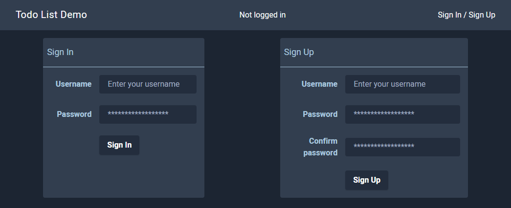
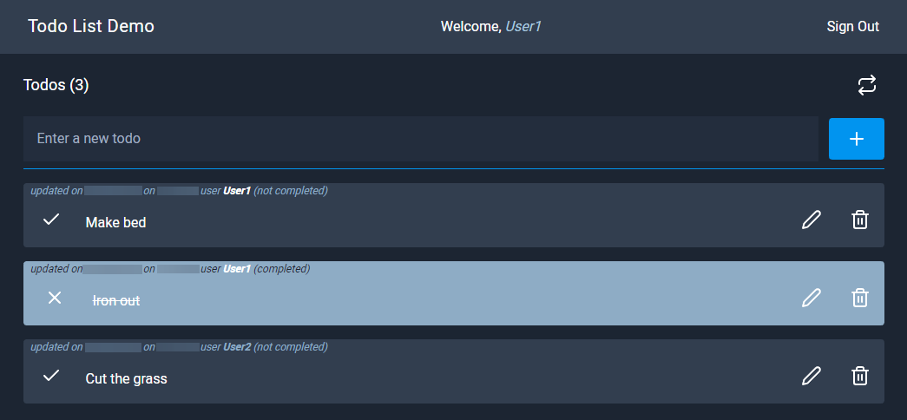

# Todo List Demo

This repo contains the backend and the frontend for an easy todo list web app for demo purposes.
The main categories managed and technologies used:
* user authentication
* user authorization
* express and graphql apollo server
* prisma.io backend crud api
* server side jwt token validation
* sapper/svelte
* tailwind css
* apollo link client
* graphql queries/mutations/subscriptions
* real time updates through graphql subscriptions

## Demo

- **frontend** [**https://todo-list-demo.surge.sh**](https://todo-list-demo.surge.sh)
- **backend** [**https://todo-list-demo-backend.epbe.dynu.net/graphql**](https://todo-list-demo-backend.epbe.dynu.net/graphql)

##

- **[Backend](/backend)**: nodejs express apollo graphql server that wraps the prisma.io crud api backend. Manage the authentication and authorization of users and the creation of the todo list.
- **[Frontend](/frontend)**: sapper/svelte app built with tailwind css. Only authenticated users can receive real time changes from another users through graphql subscriptions.

 
 
